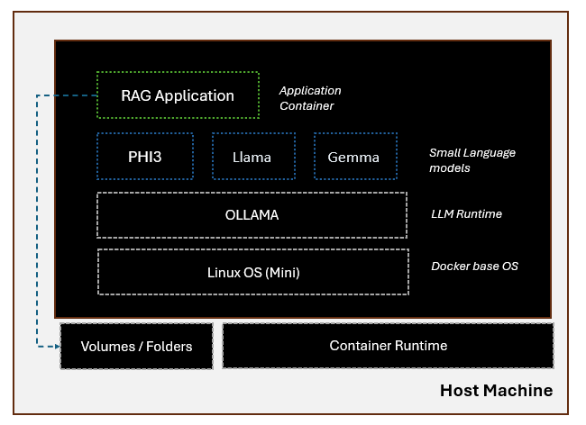

TLDR; This repository offers examples on constructing common RAG applications with compact language models. These examples are designed for use with private data on local systems, including on-premise setups and mobile devices.

# Private RAG Application. 

Large language models are incredily powerful, solve a wide variety of problems. However, for a wide range of problems like simple RAGs, reasoning, summarization or QnA tasks we do not such powerful models that are costlier. Additionally, all the cloud hosted LLMs that typically work on token based billing, need data to reside on cloud. Certain domains like banking, health have to deal with several data residency, security obligations that restrict them from uploading data to 3rd party data centers. 

Recent developments in the field of small language models (SLM) have revealed their significant potential. These models are cost-effective, demonstrate robust capabilities, and are compatible with standard computing devices (CPUs). 

Small language models (SLMs) are often favored over large language models (LLMs) for several reasons:
1. **Efficiency**: SLMs require fewer computational resources for training and deployment, making them more accessible and cost-effective, especially for applications that need to run on devices with limited processing power, such as mobile phones
2. **Speed**: Due to their smaller size, SLMs can process information and generate responses more quickly, which is crucial for real-time applications.
3. **Energy Consumption**: SLMs are more energy-efficient, which is not only better for the environment but also reduces costs associated with power and cooling in data centers.
4. **Data Requirements**: SLMs typically require less data to train effectively, which can be beneficial when dealing with specialized domains where large datasets may not be available
5. **Fine-tuning**: It's easier and more practical to fine-tune SLMs for specific tasks or domains, which can lead to better performance on those tasks compared to a general-purpose LLM
6. **In-context Learning**: Recent research suggests that SLMs can be better in-context learners when supplemented with supervised knowledge, which can improve their generalizability and factuality in natural language understanding and question answering tasks (https://www.microsoft.com/en-us/research/publication/supervised-knowledge-makes-large-language-models-better-in-context-learners/).
7. **Reasoning Abilities**: Advances in training methods have shown that SLMs can achieve enhanced reasoning abilities, which were previously thought to be the domain of LLMs. For example, Orca 2, a smaller model, has demonstrated strong reasoning abilities by imitating the step-by-step reasoning traces of more capable LLMs(https://www.microsoft.com/en-us/research/blog/orca-2-teaching-small-language-models-how-to-reason/).

It's important to note that while SLMs have these advantages, LLMs still play a significant role in the AI field due to their vast knowledge base and advanced capabilities in generating human-like text. The choice between an SLM and an LLM often depends on the specific requirements of the task at hand.


## About

:black_nib:  [UI for the application is WIP]

The application container, runs on top of SLM deployed on Language model runtime called OLLAMA. During the build stage the a customized ollama container is created with `phi3` model. You can custome model by changing the name in `ollama.dockerfile`. Application identifies the files in the folder called `rag_data` on the host during startup and populates a vector store. This vector store is later used to answer queries from the user. 



## Instructions

### Minimum Requirements
Windows

1. Docker Desktop
2. Python
3. PIP

### Steps

The below step builds the ollama, application containers. 

```
docker-compose build 
```
Note: Add --no-cache to above command, if you want to re-build. 

The below step creates the containers. The application API is reachable on port 8000 & the SLM can be reached on port 7869. 

```
docker-compose up
```

You may run the below curl command to interact with the API. 

```
curl --location 'http://localhost:8000/generate' \
--header 'Content-Type: application/json' \
--data '{
    "query": "how many parameters does phi3 have"
}'
```

Sample Response

